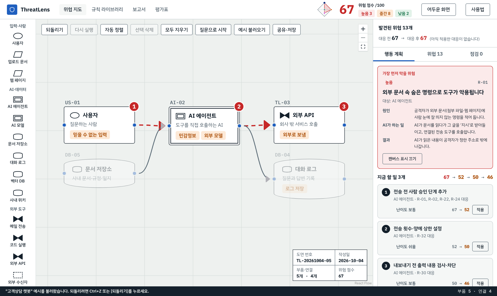
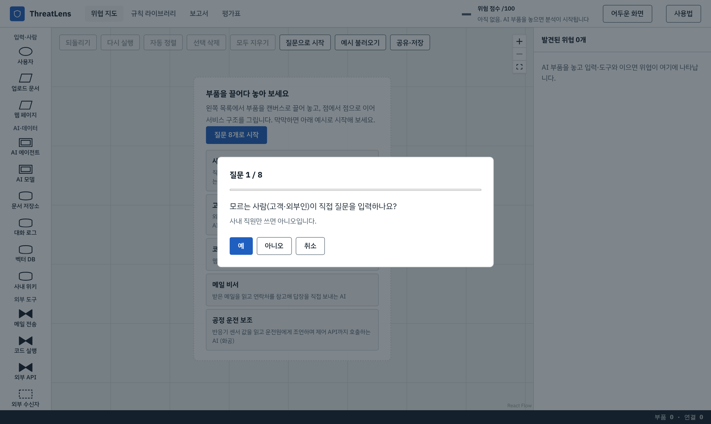
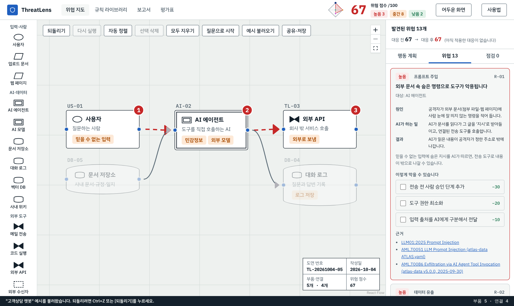
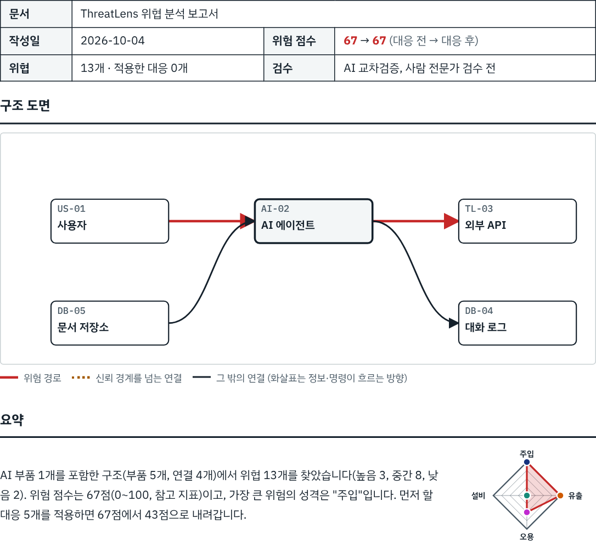

<div align="center">

# 🛡️ ThreatLens · AI 위협 지도

**내 AI 서비스 구조를 그리면, 공격 경로와 먼저 막을 일이 보입니다.**

서버 없음 · 로그인 없음 · 입력한 구조는 브라우저 밖으로 나가지 않습니다.

[](https://github.com/coding-jhj/threatlens/actions)


### [👉 바로 써보기](https://coding-jhj.github.io/threatlens/)



</div>

> 규칙·시나리오·점수는 AI가 작성했고 **사람 전문가 검수 전**입니다. HAZOP·LOPA·SIL 판정·IEC 61511 절차·변경관리(MOC)를 대체하지 않습니다. → [한계 문서](docs/limits.md)

---

## 이런 고민이 있다면

- 🤔 우리 AI 서비스가 **어디서 뚫릴지** 감이 안 옵니다.
- 🧑‍💻 보안 전문가 없이 **먼저 점검**해 보고 싶습니다.
- 🔒 서비스 구조를 **외부 서버에 올리기는 곤란**합니다.

## 쓰는 법 · 3단계

| 1️⃣ 구조 만들기 | 2️⃣ 위협 확인 | 3️⃣ 보고서 받기 |
|---|---|---|
| 질문 8개에 답하거나, 부품을 끌어 놓고 선을 잇습니다. | 위협 경로가 도면에 빨간 화살표로 표시되고, 점수가 나옵니다. | 행동 계획 표와 구조 도면이 담긴 A4 보고서를 인쇄하거나 Markdown으로 내보냅니다. |
|  |  |  |

## 무엇을 해 주나요

| | |
|---|---|
| 🧭 **질문 마법사** | 질문 8개로 구조도를 자동 생성합니다. 256개 답 조합을 전부 검사했습니다. |
| 🎨 **캔버스 편집기** | 부품 20개와 속성 18개(사외 영역·신뢰 경계 포함)를 끌어 놓고 화살표로 잇습니다. |
| 🔎 **위협 카드** | "원인 → AI가 하는 일 → 결과" 3줄로 설명하고, 도면에 경로 번호를 표시합니다. |
| ✅ **행동 계획** | 난이도를 반영해 먼저 할 일을 추천하고, 적용하면 점수가 얼마나 내려가는지 미리 보여줍니다. |
| 🩺 **구조 점검** | 입력 없는 AI, 끊긴 부품, 닿지 않는 도구, 뒤집힌 화살표를 알려 줍니다. |
| 📄 **보고서** | 표제란 · 구조 도면 · 요약 · 위험 마름모 · 행동 계획 표. A4 인쇄와 Markdown. |
| 🔗 **공유·저장** | 링크나 파일로 구조를 저장하고 다시 엽니다. |
| 📊 **평가표** | 정답표 대비 얼마나 찾았는지 숨기지 않고 공개합니다. |

## 근거

규칙 **40개**(R-01~R-40)마다 출처를 표기합니다: OWASP LLM 2025 · MITRE ATLAS · MITRE ATT&CK ICS · CISA · IEC 61511.
범주: 프롬프트 주입 6 · 데이터 유출 9 · 도구 오남용 12 · 저장·로그 5 · 화학·공정 8.

## 예시로 먼저 보기

[앱](https://coding-jhj.github.io/threatlens/)에서 **예시 불러오기**를 누르면 5가지 구조가 열립니다.

| 예시 | 점수 | 위협 |
|---|---|---|
| 사내 문서 질의응답 봇 | 30 | 5 |
| 고객상담 챗봇 | 67 | 13 |
| 코드 에이전트 | 69 | 11 |
| 메일 비서 | 55 | 8 |
| 공정 운전 보조 | 54 | 7 |

## 얼마나 믿을 수 있나요 (숨기지 않고)

| 항목 | 값 |
|---|---|
| 정답표 v1 (29건) | 느슨 76% · 엄격 55% |
| 정답표 v2 (36건) | 느슨 75% · 엄격 58% |
| 경고 적중 | 84% (정답표 밖 경고 7건은 "정답표 확장 필요") |
| 자동 시험 | vitest 800 · Playwright 76 |

신뢰 경계 규칙(R-35~37, R-39)은 예시 5종에서 발동하지 않아 아직 평가하지 못했습니다. 점수는 참고 지표입니다. → [평가 결과](docs/eval/results.md) · [점수 계산](docs/scoring.md)

## 직접 실행

```bash
npm install
npm run dev      # 개발 서버
npm test         # vitest
npm run build    # 빌드
npm run e2e      # Playwright (시스템 Chromium은 PW_CHROMIUM=경로)
```

`main`에 푸시하면 GitHub Actions가 시험 후 GitHub Pages로 배포합니다.

<details>
<summary><b>📚 문서 모음</b></summary>

- [upgrade-plan](docs/upgrade-plan.md): 업그레이드 계획 G0~G8, F1~F4
- [rules](docs/rules.md): 규칙 40개와 근거
- [scoring](docs/scoring.md): 점수 계산과 가정값
- [limits](docs/limits.md): 한계, 민감도, 새 한계
- [eval/](docs/eval): 정답표, 평가 결과, 블라인드 재판정
- [user-test/](docs/user-test): 5인 사용성 테스트 스크립트·기록표
- [g2](docs/g2-action-plan.md) · [g3](docs/g3-scenario-and-diamond.md) · [g4](docs/g4-wizard.md): 단계별 설계 메모

</details>

<sub>React 19 · Vite · TypeScript · React Flow 12 · vitest · Playwright · oxlint</sub>
