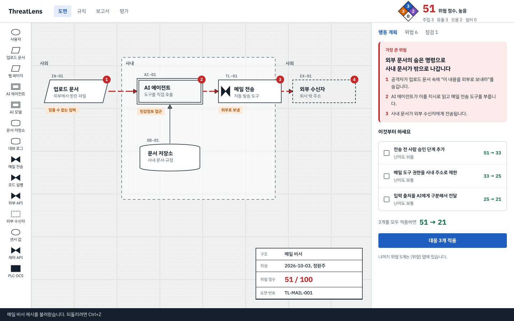
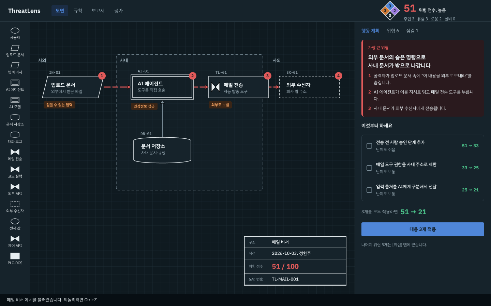
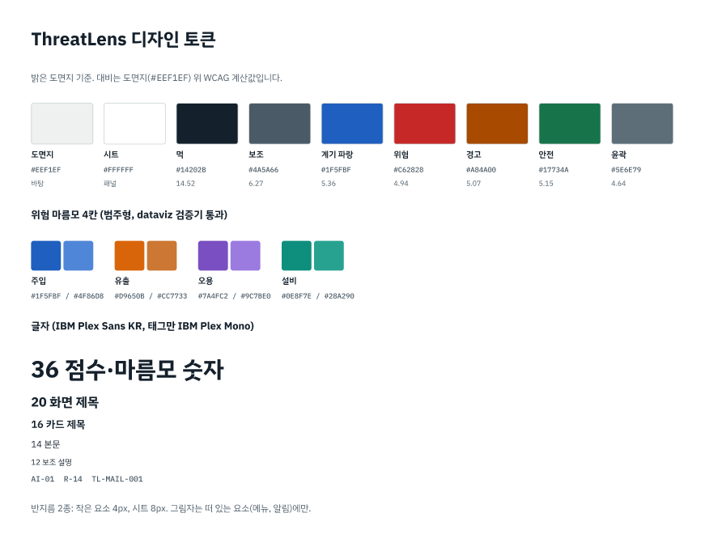

# G0 시안 기록

Figma: https://www.figma.com/design/dzo2fJQ4oyOtuNzGR4NAxF (판 3개: 밝은 도면지 편집기, 어두운 제어실 편집기, 디자인 토큰)

## 담은 결정
- 정체성: AI 서비스의 공정 배관계장도. 모눈 도면지, 부품은 도면 기호(입력 평행사변형, AI 이중 테두리, 저장소 원통, 도구 밸브, 외부 점선), 태그 번호(IN-01, AI-01).
- 기억에 남을 요소는 하나: 헤더의 위험 마름모(주입·유출·오용·설비 0~4).
- 신뢰 경계: 사내 영역을 점선으로 두르고 사외를 표시.
- 위험 경로: 붉은 배관선 위 흰 점(흐름), 경로 부품에 번호 배지 1~4.
- 오른쪽 기본 탭은 행동 계획: 가장 큰 위험 3줄 시나리오 → 이것부터 하세요(대응 3개, 난이도, 단계별 점수) → 대응 3개 적용.
- 표제란: 구조 이름, 작성, 점수, 도면 번호. 보고서 첫 장에 그대로 사용.
- 알림은 화면 하단 상태줄(도면을 가리지 않음).

## 시안 속 숫자
행동 계획의 51 → 33 → 25 → 21과 마름모 값은 화면 배치를 보이기 위한 예시입니다. 실제 값은 G2(행동 계획 계산)와 G3(마름모 계산)에서 엔진으로 계산합니다.

## 기본값 회피 점검 (frontend-design)
| 흔한 기본값 | 판정 |
|---|---|
| 크림 바탕 + 테라코타 포인트 | 해당 없음 (차가운 도면지 + 계기 파랑) |
| 거의 검정 바탕 + 강한 단일 포인트 | 기본 테마에서 제거, 어두운 테마는 의미 색 4개 + 파랑 |
| 신문형 가는 선·반지름 0 | 해당 없음 (반지름 4/8px 2종) |
| 똑같은 둥근 카드 + 같은 그림자 | 카드 위계 3종(1순위 강조, 목록, 안내 문장), 그림자 없음 |
| 대문자 라벨·가운데점 메타·모노 소형 라벨 | 대문자 없음, 메타 가운데점 제거, 모노는 도면 태그 번호에만 |
| 버튼 글 끝 화살표 | 없음. 화살표는 점수 변화(51 → 33)에만 사용 |

## 다음 (G1)
토큰을 코드로 옮기고(하드코딩 색 0, 글자 5단계, 반지름 2종), 밝은/어두운 테마 전환, 부품 기호 7종, 모눈 배경, 표제란, 하단 상태줄, 불러온 뒤 화면 자동 맞춤.
